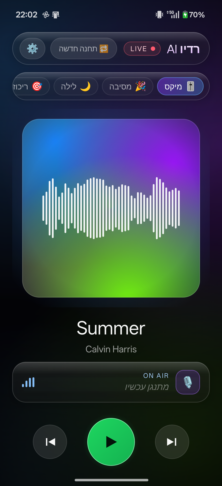

# KOLAI · קול AI

**An AI radio DJ that runs entirely on your phone.** KOLAI is a native Android app
that plays an endless, personalized Hebrew radio station — real songs stitched
together with crossfades, and a witty AI DJ that talks between tracks. No PC, no
server: the whole engine runs on-device.

> KOLAI = קול ("kol", *voice*) + AI

## 🎧 Demos

Every mood reshapes the whole station — which songs get picked, how much the DJ
talks, and how the voice itself sounds. Each demo below is a short two-song
mini-show rendered by the real pipeline in one run: the picks, the transition,
the DJ's words and the voice direction all follow the mood preset.
*Click a demo — GitHub opens it with a built-in audio player.*

| Mood | Demo | The vibe |
|------|------|----------|
| 🎚️ **מיקס** · Mix | [▶ listen (7 min)](demo/kolai-demo-mix.mp3) | The everyday flow — favorites and close neighbours, a natural arc |
| 🎉 **מסיבה** · Party | [▶ listen (9 min)](demo/kolai-demo-party.mp3) | High-energy bangers and a hyped, fast-talking host |
| 🌙 **לילה** · Late night | [▶ listen (12 min)](demo/kolai-demo-late_night.mp3) | Slow, intimate songs and a soft, hushed delivery |
| 🎯 **ריכוז** · Focus | [▶ listen (6 min)](demo/kolai-demo-focus.mp3) | Steady, low-key grooves — the DJ stays out of your way |
| ☀️ **בוקר** · Morning | [▶ listen (7 min)](demo/kolai-demo-morning.mp3) | Bright, feel-good openers and a cheerful welcome |

**[Full 30-minute show →](demo/kolai-demo-show.mp3)** (43 MB) — nine songs
picked from the listener's actual taste, mixed with beatmatched and crossfaded
transitions, and a Hebrew AI DJ dropping in with song intros, the weather, and
the news. The DJ's full script is in [`demo/dj-script.txt`](demo/dj-script.txt).

*The songs belong to their respective rights holders; these demos exist to
demonstrate the open-source pipeline.*

<p align="center">
  
</p>

## What it does

- **Endless personal station** — Hebrew AI radio, fully on-device (Kotlin /
  Compose). Plays back-to-back and gapless, with the screen off, on the lock
  screen, and in the car.
- **Your taste, real songs only** — songs are picked *in code* from your Spotify
  taste plus real-catalog discovery via Deezer; the LLM never invents a track,
  so zero hallucinated songs.
- **A real-feeling DJ** — Gemini writes *and* voices the host in Hebrew, with
  live time / weather / news context and Israeli-radio craft: addressing one
  listener, show openings, hourly anchors and a signature station ident —
  without over-talking.
- **5 mood modes** — מיקס · מסיבה · לילה · ריכוז · בוקר reshape the song
  selection, the DJ's energy and the voice delivery (hear them above).
- **Sounds like broadcast** — loudness normalization to a broadcast target plus
  a soft limiter across songs and speech; album covers from Deezer.
- **Android Auto** — the station on the car screen: steering-wheel skip,
  per-song metadata and cover art.
- **Self-healing playback** — a render watchdog and retries keep the station on
  air even when a song or an API misbehaves.
- **Liquid-glass RTL UI** — Hebrew-first design with a mood-reactive palette.
- **Free stack** — Gemini LLM + TTS, Spotify, Deezer and YouTube, all on free
  tiers; you bring your own keys.

## How it works

```
Spotify taste + Deezer discovery  ->  setlist (picked in code)
                                            |
                              fetch audio (YouTube / NewPipe)
                                            |
                        analyze (Essentia: BPM, key, energy)
                                            |
      DJ script + voice (Gemini TTS)  ->  mix block (crossfade + duck + loudness)
                                            |
                                 ExoPlayer (gapless, endless)
```

Music plays in **blocks** — each block is 2-3 songs beat-matched and crossfaded,
with the DJ ducked in over the intros and outros. The next block renders ahead
while the current one plays, so the station never stops.

## Tech

- **Android** — Kotlin, Jetpack Compose (RTL Hebrew "liquid-glass" UI), Media3
  ExoPlayer + MediaSessionService, Android Auto (MediaLibraryService).
- **Audio analysis** — [Essentia](https://essentia.upf.edu/) cross-compiled for
  arm64 (NDK) for BPM / musical key / energy (Krumhansl key detection).
- **Decode / encode** — MediaExtractor / MediaCodec / MediaMuxer (PCM <-> AAC).
- **Acquire** — NewPipeExtractor for YouTube; Deezer for catalog truth + covers.
- **AI** — Gemini LLM (DJ text) + Gemini TTS (DJ voice) over Ktor REST, with
  multi-key rotation to stretch the free quota.
- **Build** — multi-module Gradle (`:core :acquire :analyze :mix :voice :station
  :dsp :app`).

The repo also keeps the original **Python POC** (`backend/`) and a **React/Vite
PWA** (`frontend/`) that pioneered the pipeline and the design system; the Android
app is the standalone successor.

## Repo layout

| Path | What |
|------|------|
| `android/`  | The native KOLAI Android app (the real product) |
| `backend/`  | Original Python engine — reference POC (renders the demos above) |
| `frontend/` | React PWA — the web prototype + design system |
| `docs/`     | Specs and implementation plans |

## Status

The MVP **works end-to-end on a real device**: tap, it tunes in, then plays an
endless station with a Hebrew DJ — gapless, with mood modes, Android Auto, and a
mood-reactive liquid-glass UI.

**Planned next:** live Spotify login (today it seeds from cached taste), on-device
API-key entry, full-quality audio, two-host banter, and a one-tap "new station".

## Running it yourself

You bring your own keys — **none are included in this repo**:

- Add 1-3 Gemini API keys to `android/app/src/main/assets/kolai_dev.properties`
  (gitignored).
- (Backend, optional) copy `backend/.env.example` to `backend/.env` and fill it in.

Then build the `:app` module for `arm64-v8a` and install on an Android 12+ device.

---

*A personal project. Not affiliated with Spotify, YouTube, or Google.*
